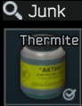
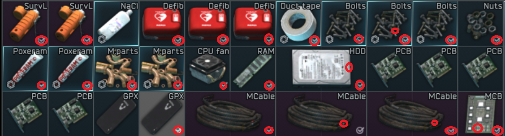
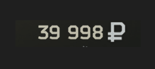
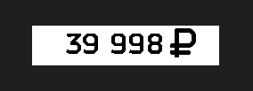

# AN ***EDUCATIONAL*** TARKOV BOT FOR SELLING ITEMS ON THE MARKET
This bot is not a complete nore is it a completely safe version , you can and most likely be banned if used wrong

# A need for Automation
    Escape from Tarkov is a video game on which I spent a lot of time, especially during the pandemic. One of the multiple complicated mechanics is the player-based economy.  
    Including a market on which players can sell items at a price according to supply and demand. Each player has a limited amount of market slots (the number of items you can put up for sale at a time).
    Currently, there are 1634 items (not counting the slight variations in colors, etc) which means selling all the items you find can be very time-consuming.
    So it took on me to create a bot that can navigate menus, identify sellable objects in the stash (inventory), and goes through the whole procedure of selling the item at the best price and as fast as possible.

# TLDR !
A bot that opens a loot box, scans and notes all the items in the box that it wants to sell, identifies and navigates through menus using OpenCV computer vision, And PyAutoGUI. Reads the lowest current price with OpenCV on a post-treated screenshot, undercuts the price puts it up for sale, waits for it to be sold, rinse and repeat.

## The challenges !
There are quite a few challenges presented going into this project.

**No API**, so moving windows and navigating through menus has to be done by simulating keystrokes and mouse movement (PyAutoGUI).
To navigate through menus and find items we need to be able to determine which menu we are in, and when to look for menus and items. (OpenCV)
To sell the items at the right price we need to read the numbers on the screen. (OpenCV)
Automation of keystrokes and mouse movements.
To answer the first problem I used PyAutoGUI a python library that can simulate keyboard inputs and mouse movement, like a HID device. Using this we can move windows, click, double-click, and set randomness to the bot movement to avoid detection from the game engine. From an outside point of view, it looks like the mouse is moving on its own.

## Indentification of menues and items.
The bot needs an organized inventory to aid its functions. Instead of relying on OPENCV's ability to read text on an image we can use what is always the same.
We demand that the user place the box with the sellable items always in the same place.

This is a less adaptable system but at the same time analyzing a large portion of the screen is demanding in time and the whole point of this bot is to be faster than a human.

Tarkov is a very variable game, opening containers will always open the same sub-inventory but not always in the same space on the screen. But once again we rely on regular things in this case all junk cases windows have a recognizable corner.

So we use OPENCV to find that window in the portion of the screen. We portion out part of the screen as the sub-inventory is quite large so the window bar can only be on the upper end of the screen.
Knowing the position of the sub-inventory we can move it by "dragging" it using PyAutoGUI.

This is the basis for 90% of the navigation of the bot. For checking status like: "Do we have a slot on the market left", "am I in the right game state (menu)", etc. We compare pixel color with static pixels which correspond to different game states.
## LEGACY
For the old version (which is more interesting for computer vision), each item we'd want to sell has a "found in raid" icon on it, OpenCV identifies them, makes a list of their X, and Y positions on the screen.
When the window is at the chosen position the bot clicks on it and sells them through a couple of keybinds. It is important to note that you can sell multiple of the same item at the same time taking only one slot.
For the current version which is faster, we just use an offset from the top of the inventory window because the items are set on a grid. (See examples).
The game has an auto-select "similar items" which is a lifesaver for time. To avoid clicking on empty slots, to make sure that the pixel on the next position is not the same color as the background.

I won't explain any more on how navigation works as it is quite repetitive, if you want to take a look at the source code check out my git repo for this project.
Examples of inventories and visual markers used to navigate and mark items:

## Preprocessing of images for computer vision
Reading prices was a difficult challenge in itself as I had to learn how to correctly modify an image to get the best and most repeatable results. The background around the price is not static. In the menu the leaves of a tree move in the wind making it hard to get consistent reading on prices. To avoid that filter only certain RGB values corresponding to the colors of the numbers giving us a grayscale image of only the price which is much easier to read. A couple of characters in the font resemble other characters like: "S" resembles "5", and "@" resembles "0" so we filter and convert. In the case where it can not be read, the bot stops to avoid selling items at poor prices.
Photo

This bot uses OCR to recognize and read prices, but the prices are first screenshoted and post treated to get a black and white image:
### BEFORE :

### AFTER :

## HOW TO USE
The bot is made for a 2K resolution screen, it use Junkcases called something containing "sell" in the name.
The bot can be broken if interrupted, it is best to use for full cases that are sort by item size.
1 slot items in a case, 2+ in others. Try to group up items to take advantage of the "auto select fonction"

 
## HOW IT WORKS
The bot uses pixel colors at precise coordinates to determine which menu it is in. Using computer vision Libaries the bot can find the boxes, scroll through menues select the items.

Once the item is select the bot will take a screen capture of the price, up the saturation and put it in black and white and run it through computer vision to get the price and take of a percentage to assure the price is the lowest without price guaging.

FOR more info the code is commented on all branches (at least it should :)).
Check out the branches for more versions.
